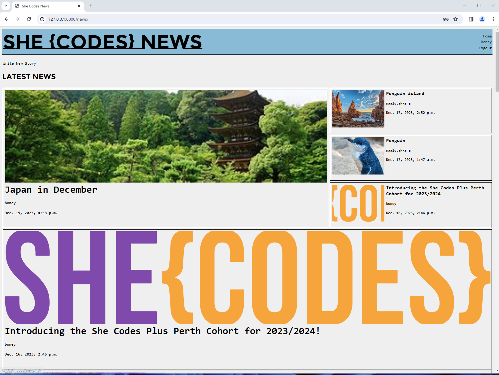
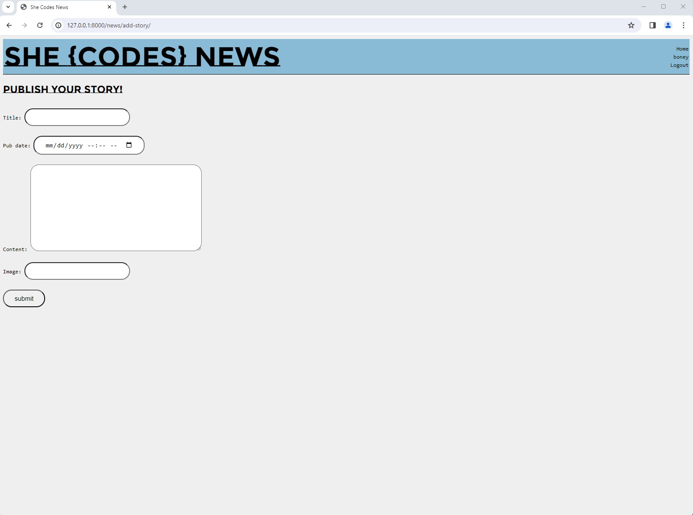
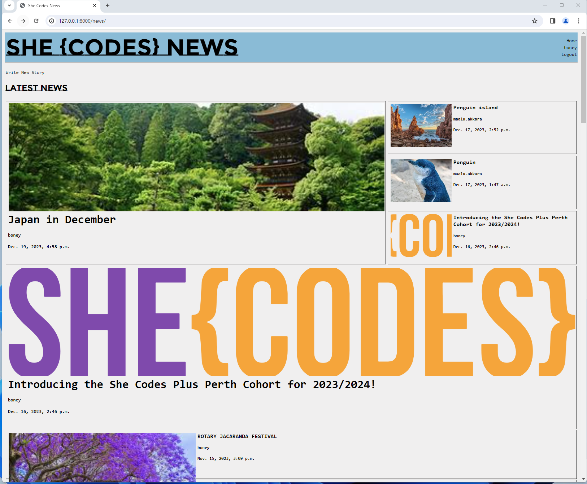
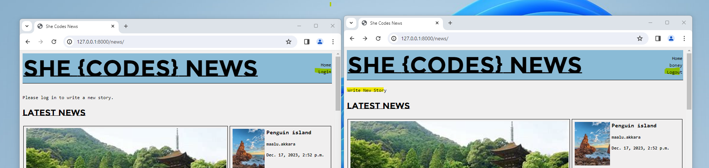
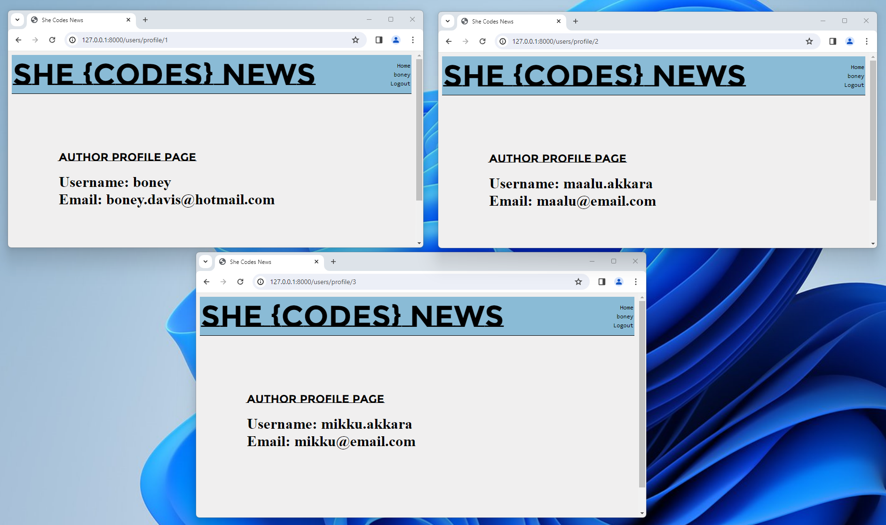
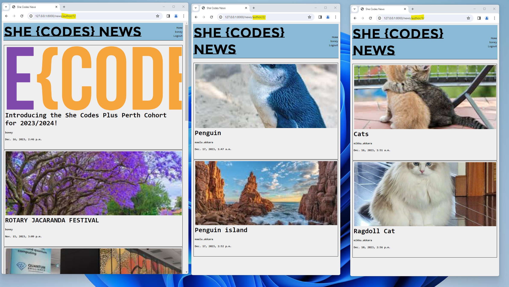
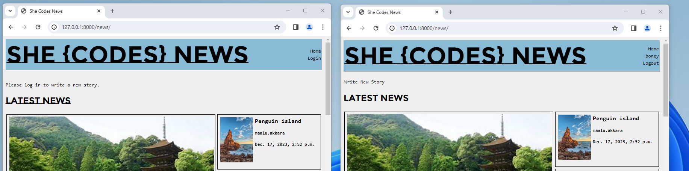
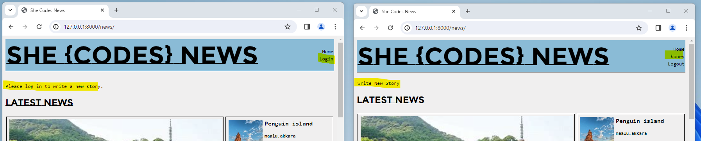
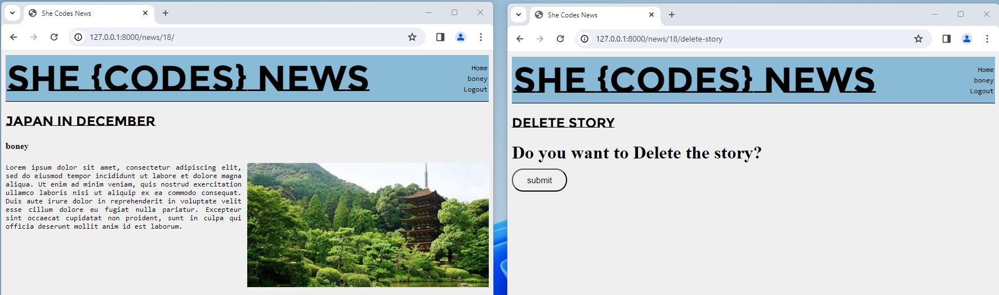

# Boney Davis - She Codes News Project

## About This Project - Created a website for She Codes News that allows users to read news stories, and authors to create them. Users can create profiles to publish stories and view profile information for the authors.

## How To Run This Code
{{
    STEP 1:
 copy the repo over to your own Github account 

 Next, visit the newly created repo on your Github, and click the "Code" button to getthe url to clone:

 Finally, jump into a terminal and navigate to wherever you've been storing yourprojects so far. Then clone the repo down to your local machine, like so: `git clone <your_link_goes_here>`

    STEP 2:
 In the terminal, change directory into the repo you just cloned down:
 `cd your_repo`

 Now, create a new virtual environment, like so
 `python -m venv venv`

 Then activate the environment:
 Windows command: `.venv/Scripts/activate`
 Mac command:`source venv/bin/activate`

 Now install the requirements:
 `python -m pip install -r requirements.txt`
 
 open the repo in VS Code
 `code .`

    STEP 3 - Make The Initial Migrations

 To make migrations,  change directories so that you're next to the `manage.py` file. 
 Now make the initial migrations: `python manage.py migrate`
 Finally, check that the starter code is working correctly by running the server:`python manage.py runserver`

    }}

## Database Schema

## Project Features
[x] Order stories by date

[x] Styled "new story" form

[x] Story images

[x] Log-in/log-out

[x] "Account view" page

[x] "Create Account" page

[x] View stories by author

[x] "Log-in" button only visible when no user is logged in/"Log-out" buttononly visible when a user *is* logged in

[x] "Create Story" functionality only available when user is logged in

## Additional Features:

[x] Add the ability to delete stories (Could not work on permissions part , This is just a page to delete stories).
